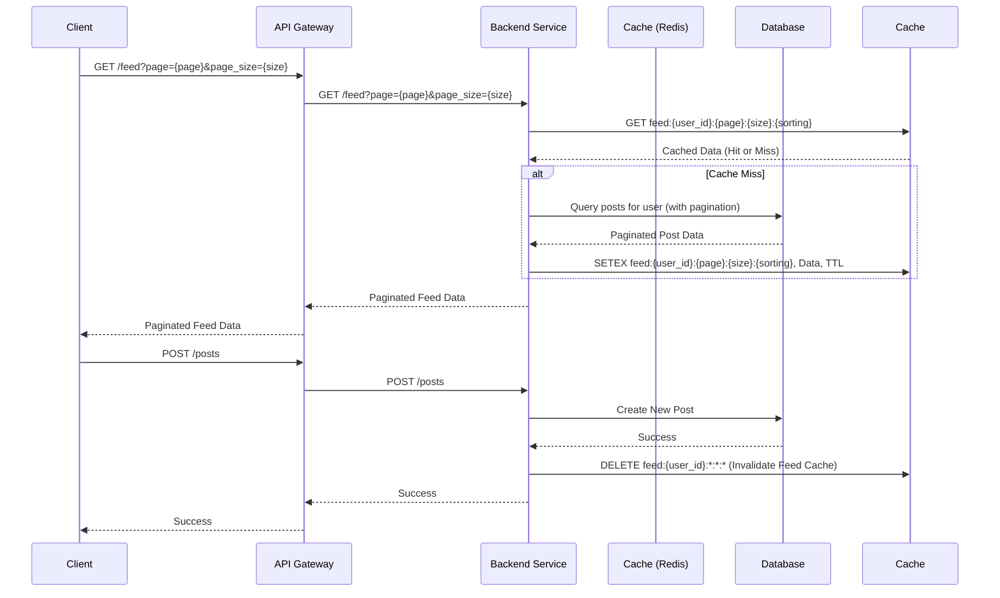
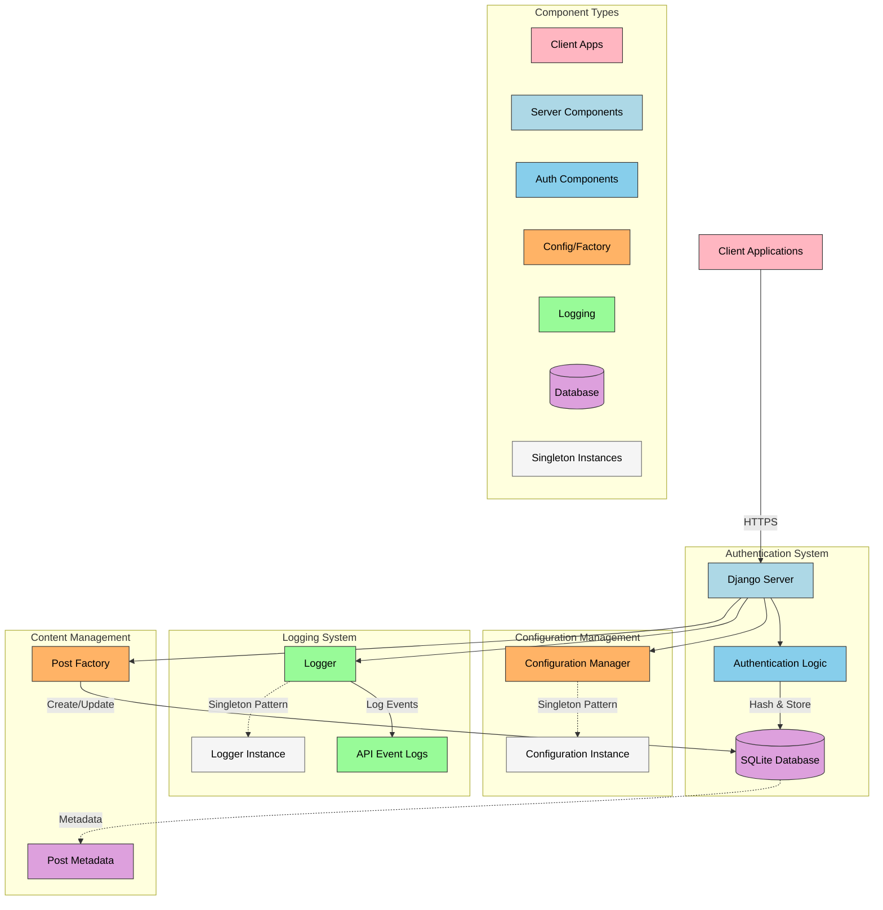
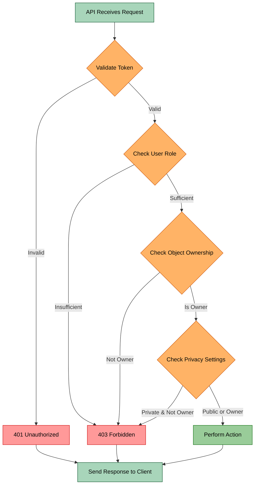

## Diagrams

### Homework 9:

**1. CRUD Interaction Flow Diagram**

**Interpretation:**

This diagram illustrates the sequence of interactions involved in retrieving the news feed (`GET /feed`) and creating a new post (`POST /posts`), specifically highlighting the integration of pagination and caching using Redis.

- **Client:** The initiator of the API requests, such as a web browser or mobile application.
- **API Gateway:** An optional intermediary that handles routing and potentially other cross-cutting concerns before requests reach the backend service.
- **Backend Service:** Represents the core application logic, which in our case is likely implemented using Django.
- **Cache (Redis):** An in-memory data store used to cache frequently accessed feed data to improve performance and reduce database load.
- **Database:** The persistent storage for the application's data, which we've assumed to be SQLite based on the original architecture.

**Logical Scenarios:**

**Scenario 1: Retrieving the News Feed (`GET /feed`) with Pagination and Caching**

- The `Client` sends a `GET /feed` request to the `API Gateway` (if present), including parameters to specify the desired page (`page`) and the number of items per page (`page_size`).
- The `API Gateway` routes this request to the `Backend Service`.
- The `Backend Service` first attempts to retrieve the feed data from the `Cache (Redis)`. It constructs a cache key that incorporates the user's identity (implicitly assumed in `feed:{user_id}`), the requested `page`, the `page_size`, and the sorting criteria.
- **Cache Hit:** If the data is found in the `Cache (Redis)` using the generated key, the `Cache` returns the cached data directly to the `Backend Service`.
- **Cache Miss:** If the data is not found in the `Cache (Redis)`:
  - The `Backend Service` queries the `Database` to retrieve the posts relevant to the user, applying the specified pagination to fetch only the required subset of data.
  - The `Database` returns the paginated post data to the `Backend Service`.
  - The `Backend Service` then stores this retrieved data in the `Cache (Redis)` using the same cache key, along with a `TTL` (Time-To-Live) to ensure the data doesn't become too stale.
- The `Backend Service` sends the paginated feed data back through the `API Gateway` to the `Client`.

**Scenario 2: Creating a New Post (`POST /posts`) and Cache Invalidation**

- The `Client` sends a `POST /posts` request to the `API Gateway`.
- The `API Gateway` routes the request to the `Backend Service`.
- The `Backend Service` creates the new post in the `Database`.
- The `Database` confirms the successful creation to the `Backend Service`.
- To ensure data consistency, the `Backend Service` invalidates the relevant feed cache in `Cache (Redis)`. It does this by deleting any cache entries associated with the user's feed, regardless of the page or page size. This forces the next request for the feed to fetch fresh data from the database and repopulate the cache.
- The `Backend Service` sends a success response back through the `API Gateway` to the `Client`.

**2. System Architecture Diagram**

**Interpretation:**

This diagram provides a high-level overview of the system's components and their relationships, with a focus on highlighting the role of the Redis cache.

- **Client (Postman / Client):** Represents the external entity interacting with the application.
- **Server (Django Server):** The core application server built using the Django framework.
- **Configuration Manager:** A component responsible for managing application configurations. It's implemented as a Singleton for centralized access.
- **Logger:** A component for logging application events, also implemented as a Singleton.
- **AuthLogic:** Represents the part of the application handling authentication and managing relationships between users, posts, and comments.
- **Post Factory:** A component using the Factory pattern to create post objects.
- **Database (SQLite Database):** The persistent data store.
- **Cache (Redis):** The in-memory data store used for caching.

**Logical Flow:**

1.  The `Client` communicates with the `Server` (Django Server) via HTTPS.
2.  The `Server` relies on the `Configuration Manager` for settings and the `Logger` for recording events.
3.  The `Server` interacts with `AuthLogic` for authentication and data relationship management, which in turn interacts with the `Database`.
4.  When creating posts, the `Server` uses the `Post Factory`, which ultimately interacts with the `Database`.
5.  **Key Addition:** The `Server` also interacts with the `Cache (Redis)`. This interaction is primarily for reading data (cache hits) to improve performance. In cases of cache misses or data modification, the `Server` might also write to the `Cache`.
6.  The `Cache (Redis)` can potentially interact with the `Database` indirectly, as the `Server` might fetch data from the database to populate the cache.

**Key Takeaways from the Updated Diagrams:**

- **Pagination is Integrated:** The CRUD Interaction Flow Diagram clearly shows how pagination is handled in the feed retrieval process.
- **Caching with Redis:** Both diagrams now explicitly include Redis as a `Cache` component, highlighting its role in the architecture.
- **Cache-Aside Pattern:** The CRUD Interaction Flow Diagram suggests a cache-aside pattern where the application explicitly checks the cache before accessing the database.
- **Cache Invalidation Importance:** The CRUD Interaction Flow Diagram demonstrates the need for cache invalidation when data is modified.
- **Focus on Performance:** The inclusion of the `Cache (Redis)` in the architecture emphasizes the effort to improve performance through caching.

---

### Homework 8: Privacy Settings and Role-Based Access Control (RBAC)

**1. Access Control Flow Diagram**

### Core Components

1. **Request Reception** - The API receives an incoming request

- This marks the entry point of the validation chain
- All subsequent steps are dependent on this initial request

2. **Token Validation** - First line of defense in the security chain

- Checks for presence and validity of authentication token
- Two possible outcomes: - Valid token → Proceeds to role checking
  - Invalid token → Returns 401 Unauthorized response

3. **Role-Based Access Control (RBAC)** - Evaluates user's permission level

- Two possible paths: - Sufficient role → Proceeds to ownership check
  - Insufficient role → Returns 403 Forbidden response

4. **Object Ownership Verification** - Checks if user has ownership rights

- Two possible outcomes: - Is owner → Proceeds to privacy settings check
  - Not owner → Returns 403 Forbidden response

5. **Privacy Settings Evaluation** - Final security checkpoint

- Two possible paths: - Public or owner access → Proceeds to action execution
  - Private and not owner → Returns 403 Forbidden response

6. **Action Execution and Response** - Performs the requested action

- Sends response back to client
- Handles both successful and error responses

### Security Logic Flow

The diagram implements a layered security approach where each validation step must be passed successfully before proceeding to the next:

1. **Authentication Layer** - Token validation ensures only authenticated users can proceed

- Immediate rejection of unauthorized requests
- Prevents unauthorized access attempts early in the process

2. **Authorization Layer** - Role checking ensures users have appropriate permissions

- Ownership verification adds an additional security layer
- Privacy settings provide fine-grained access control

3. **Error Handling** - Consistent error response pattern (401/403)

- Clear separation between authentication and authorization failures
- All error paths converge to the response handler

### Flow Logic

The diagram's top-down structure represents a sequential validation process where:

1. Each diamond shape represents a decision point
2. Rectangular boxes represent actions or processes
3. Arrows show the flow direction and possible paths
4. Color coding helps distinguish between different types of operations: - Green: Processing steps

- Orange: Decision points
- Red: Error responses
- Light green: Successful actions

---

### Homework 7: Building a News Feed

**1. CRUD Interaction Flow Diagram**

**User Operations:**
_ Frontend sends requests to the API for creating, retrieving, updating, and deleting users.
_ API interacts with the database to perform these operations. \* API sends back the corresponding data or success/error messages to the frontend.

- **Post Operations:**
  - Similar to user operations, but for creating, retrieving, updating, and deleting posts.
  - Includes actions for liking and unliking posts.
- **Comment Operations:**
  - Handles CRUD operations for comments on posts.
- **Like Operations:**
  - Handles Like and Unlike operations.
- **Follow Operations:**
  - Handles CRUD operations for follow relationships.
- **Feed Operations:**
  - Frontend requests the news feed from the API.
  - API retrieves filtered and sorted posts from the database.
  - API returns the post data to the frontend.

---

**2. System Architecture Diagram**

- **Frontend (React):**
  - User interface for interacting with the API.
- **API Gateway:**
  - Entry point for all API requests.
  - Routes requests to the appropriate services.
- **Authentication/Authorization:**
  - Verifies user credentials and authorizes access to protected resources.
  - JWT token validation occurs here.
- **Posts API (Django/DRF):**
  - Handles all post-related operations.
  - Includes logic for creating, retrieving, updating, and deleting posts, comments, likes, and follow relationships.
- **Database (PostgreSQL):**
  - Stores all application data (users, posts, comments, likes, follow relationships).
- **Feed Logic:**
  - Handles the retrieval and filtering of posts for the news feed.
- **Follow Logic:**
  - Handles the retrieval and creation of follow relationships.
- **Error Response:**
  - Handles invalid authentications.

---

### Homework 6: Integrating Third-Party Services

**1. Authentication and Authorization Flow Diagram**

- **Initiate Google Login:**

  - The user, through the React frontend, initiates the Google login process.
  - This action redirects the user to Google's OAuth 2.0 authorization server.

- **Google ID Token:**

  - Upon successful authentication with Google, Google's server returns an ID token to the React frontend.
  - This token contains user information and serves as proof of authentication.

- **POST /api/auth/social/google/:**

  - The React frontend sends a POST request to the backend's `/api/auth/social/google/` endpoint.
  - This request includes the Google ID token in the request body.

- **Verify ID Token:**

  - The Django/DRF backend receives the ID token and sends it to Google's verification service.
  - This step ensures the token's authenticity and validity.

- **Verification Result:**

  - Google's verification service returns a result to the backend, indicating whether the token is valid or invalid.

- **Token Valid (Conditional):**

  - If the token is valid, the backend proceeds with the following steps:
    - **Check Social Account:**
      - The backend queries the database to check if a social account associated with the Google user ID already exists.
    - **Social Account Exists/Not Exists (Conditional):**
      - **Social Account Exists:**
        - If the social account exists, the backend retrieves the corresponding user data from the database.
      - **Social Account Does Not Exist:**
        - If the social account does not exist, the backend requests user information from Google.
        - The backend then creates a new user and a new social account record in the database.
    - **Update/Create Social Login:**
      - The backend updates or creates a social login entry in the database, linking the social account to the user.
    - **Generate JWT Token:**
      - The backend generates a JSON Web Token (JWT), containing access and refresh tokens.

- **JWT Token:**

  - The backend sends the generated JWT token to the React frontend.

- **Store JWT Token:**

  - The React frontend stores the JWT token for subsequent API requests.

- **Protected API Request:**

  - The React frontend makes a request to a protected API endpoint, including the JWT token in the Authorization header.

- **Validate JWT Token:**

  - The Django/DRF backend receives the request and validates the JWT token.

- **Token Valid (Conditional):**

  - If the JWT token is valid:
    - **Fetch Resource:**
      - The backend retrieves the requested resource from the database.
    - **Resource Data:**
      - The backend sends the resource data to the React frontend.

- **Token Invalid (Conditional):**
  - If either the Google ID token or the JWT token is invalid, the backend returns an error response to the React frontend.

---

### Homework 5: Adding User Interactions (Likes and Comments)

**1. Data Relationship Diagram**

This diagram illustrates the structure and relationships between your core models: `User`, `Post`, `Comment`, and `Like`. Here’s a breakdown:

- **User ↔ Post:**  
  A one-to-many relationship — a single `User` can create multiple `Posts` (`author` field).
- **User ↔ Comment:**  
  Another one-to-many relationship — a `User` can write multiple `Comments` (`user` field).
- **Post ↔ Comment:**  
  A one-to-many relationship — a `Post` can have many `Comments` (`post` field).
- **User ↔ Like:**  
  A one-to-many relationship — a `User` can like multiple `Posts`, but only once per post (enforced by `unique_together`).
- **Post ↔ Like:**  
  A one-to-many relationship — a `Post` can receive many `Likes` from different users.

This diagram reflects how data is stored and linked in the API. When creating views and serializers, understanding these relationships makes it easier to structure queries, permissions, and validations efficiently.

---

**2. CRUD Interaction Flow Diagram**

This shows how different API endpoints enable CRUD (Create, Read, Update, Delete) operations on the resources — `User`, `Post`, `Comment`, and `Like`. It reflects your RESTful API design:

- **Users:**

  - `POST /users/` — Create a user
  - `POST /users/login/` — User login
  - `GET /users/{id}/` — Retrieve a specific user
  - `PUT /users/{id}/` — Update user details
  - `DELETE /users/{id}/` — Delete a user

- **Posts:**

  - `POST /posts/` — Create a post
  - `GET /posts/` — List all posts
  - `GET /posts/{id}/` — Retrieve a specific post
  - `PUT /posts/{id}/` — Update a post
  - `DELETE /posts/{id}/` — Delete a post

- **Comments:**

  - `POST /comments/` — Add a comment to a post
  - `GET /comments/?post={id}` — Get comments for a specific post
  - `PUT /comments/{id}/` — Update a comment
  - `DELETE /comments/{id}/` — Delete a comment

- **Likes:**
  - `POST /posts/{id}/like/` — Like a post
  - `DELETE /posts/{id}/like/` — Unlike a post
